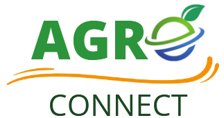

# AgroConnect
 

## Informações Gerais
- **Disciplina**: AS63C - Desenvolvimento Ágil
- **Ano/Semestre**: 2024/1

## Integrantes do Grupo

- [Guilherme Sebastião](https://github.com/guievbs)  

- [Robson Carvalho](https://github.com/robsonldcarvalho)  

- [Matheus Marinho](link_para_github)
 
- [Diego Otani](https://github.com/DiegoOtani)  

- [João Buczora](link_para_github)  

- [Floriano](https://github.com/gabrielflorianoo)

- [Eduardo](https://github.com/eduzindejesus)  

- [Celso](https://github.com/Celsolf)  

## Descrição do Projeto
Aplicativo agrícola que oferece uma
plataforma centralizada para visualização de cotações de
preços de commodities agrícolas e fornece notícias relevantes
do mercado que impactam o setor agrícola.

### Objetivo
O objetivo principal do projeto é desenvolver um protótipo de alta fidelidade, seguindo as práticas ágeis aprendidas na disciplina.

### Principais Funcionalidades
- [Funcionalidade 1]
- [Funcionalidade 2]
- [Funcionalidade 3]

## Documentos no Repositório

- [Requisitos Funcionais](https://github.com/guievbs/agro-connect-2024.1/blob/main/Requisitos%20de%20Usu%C3%A1rio/rf.md)
- [Requisitos Não Funcionais](https://github.com/guievbs/agro-connect-2024.1/blob/main/Requisitos%20de%20Usu%C3%A1rio/rnf.md)
- [História de Usuário](https://github.com/guievbs/agro-connect-2024.1/blob/main/Requisitos%20de%20Usu%C3%A1rio/historiaUsuarios.md)
